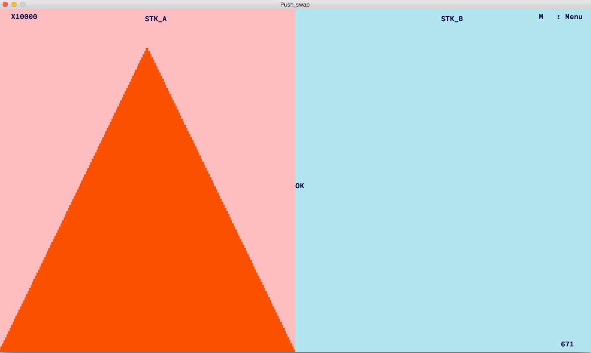

# Push_Swap

## Pitch

Push_Swap is a pedagogical project from 42 School which aims to introduce the students to sorting algorithms.
This project make you sort data on a stack, with a limited set of instructions, using the lowest possible number of actions. To succeed you have to manipulate various types of algorithms and choose the one (of many) most appropriate solution for an optimized data sorting.

## Main features

- Combination of Quicksort and selection sort for an optimized result
- Visualisation
- Number of operation in real time
- Changing speed
- Changing colors 

## Things I have learned

- Better understanding of the C programming language and how to structure the code to keep a growing program maintanable, and open to new features.
- How to chose and implement an algorithm based on its complexity. 
- How to organise a project with several modules (checker and push_swap). Specific Makefile for both programs.

## Compile and run

If ./checker or ./push_swap does not exist use make.
 
Then to print commands run: 
	./push_swap $ARG
 
To use checker with visualiser run: 
	./push_swap ARG | ./checker -v $ARG
 
You must have define ARG with a set of number as described in subject. You can initialize ARG with this command

	ARG=`ruby -e "puts (1 ... 100).to_a.shuffle.join(' ')"`

Replace(1 ... 100) with the numbers you want to test.

example :
	
	make
	ARG100=`ruby -e "puts (1 ... 100).to_a.shuffle.join(' ')"`
	./push_swap $ARG100 | wc -l; ./push_swap $ARG100 | ./checker -v $ARG100

## Keys

- M : Menu
- → : Faster
- ← : Slower
- 1 : Colorfull
- 2 : Black & white
- 3 : Random
- 4 : Negative
- \<esc\> : Quit
